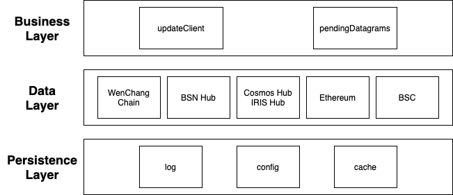
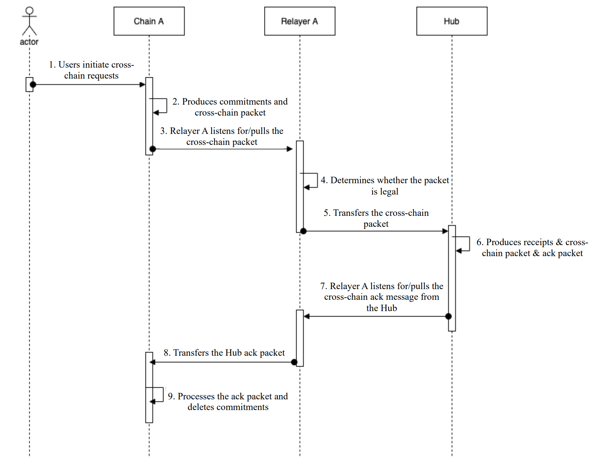
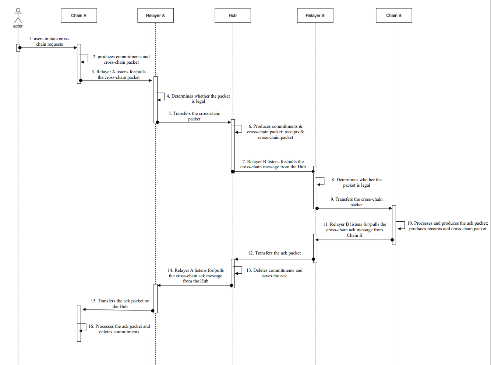

| tics | title                                      | stage  | category                        | kind       | requires  | required-by     | author                               | created  | modified  |
| ---------------- | ---------------------------------------------- | ---------- | ----------------------------------- | -------------- | ------------- | --------------------- | ---------------------------------------- | ------------ | ------------- |
| 18               | Relayer Algorithms | draft  | TIBC/TAO  | interface  | 23            |  | | 2021-07-26   | 2021-07-26   |

## Synopsis

Relayer algorithms are the "physical" connection layer of TIBC — off-chain processes responsible for relaying data between two chains running the TIBC protocol by scanning the state of each chain, constructing appropriate datagrams, and executing them on the opposite chain as allowed by the protocol.

### Motivation

In the TIBC protocol, a blockchain can only record the intention to send particular data to another chain — it does not have direct access to a network transport layer. Physical datagram relay must be performed by off-chain infrastructure with access to a transport layer such as TCP/IP. This standard defines the concept of a relayer algorithm, executable by an off-chain process with the ability to query chain state, to perform this relay.

### Definitions

A *relayer* is an *off-chain* process with the ability to read the state of and submit transactions to some set of ledgers utilizing the TIBC protocol.

### Desired Properties

- No exactly-once or deliver-or-timeout safety properties of TIBC should completely depend on relayer behavior (assume Byzantine relayers).
- Packet relay liveness properties of TIBC should depend only on the existence of at least one correct, live relayer.
- Relaying should be permissionless, all requisite verification should be performed on-chain.
- Requisite communication between the TIBC user and the relayer should be minimized.
- Provision for relayer incentivization should be possible at the application layer.

## Technical Specification

### Basic relayer algorithm

The relayer algorithm is defined over a set *C* of chains implementing the TIBC protocol. Each relayer may not necessarily have access to read state from and write datagrams to all chains in the interchain network (especially in the case of permissioned or private chains) — different relayers may relay between different subsets.

`relay` is called by the relayer every so often — no more frequently than once per block on either chain, and possibly less frequently, according to how often the relayer wishes to relay.  

Different relayers may relay between different chains — as long as each pair of chains has at least one correct & live relayer and the chains remain live, all packets flowing between chains in the network will eventually be relayed.

Relayer supports implementing multi-client SDK, but only two connected chain configurations can be configured for each instantiation started.

#### Relayer architecture



For the newly connected SDK client, the following interfaces must be implemented:

```go
interface IChain {
    func GetBlockAndPackets(height uint64)  (interface{}, error);
    func GetBlockHeader(height uint64)  (interface{}, error);
    func GetLightClientState(chainName string)  (interface{}, error); 
    func GetLightClientConsensusState(chainName string, height uint64)  (interface{}, error);
    func GetStatus()  (interface{}, error);
    func GetLatestHeight()  (uint64, error);
    func GetDelay()  uint64;
}
```

The following interfaces need to be implemented on the business layer:

```go
interface IService {
    func UpdateClient(chain: Chain, counterparty: Chain);
    func PendingDatagrams(chain: Chain, counterparty: Chain): List<Set<Datagram>>;
}
```

Relayer performs relay with two thread management datagrams.

Thread 1 is mainly used to regularly update the availability of the client.

```go
func UpdateClient(chain: Chain, counterparty: Chain) {
    height = chain.GetLatestHeight()
    client = counterparty.GetLightClientConsensusState(chain)
    if client.height < height {
      header = chain.GetBlockHeader(height+1)
      counterpartyDatagrams.push(ClientUpdate{chain, header})
    }
    submitDatagramHeader = ConversionHeaderMsg(blockData)
    submitTx(txs, dest)
}
```

Thread 2 is mainly used to relay `packet` ,the process is as follows:

1. The relayer obtains the latest **relayed** height `latestHeight` of the **source chain** from the target chain.
2. The relayer obtains the header of `latestHeight+1` and the `packet` of `latestHeight-delay` from the **source chain**.
3. The relayer assembles the obtained `submitDatagramHeader` and `submitDatagramPacket` information, and then submit them

```go
func pendingDatagrams(source: Chain, dest: Chain) {
    latestHeight = dest.GetLightClientState(chain_name)
    blockData = source.getBlockHeader(latestHeight+1)
    submitDatagramHeader = ConversionHeaderMsg(blockData)
    blockPacketData, proof = source.GetBlockAndPackets(latestHeight-delay)
    submitDatagramPacket = ConversionPacketMsg(blockPacketData, proof)
    txs = []tx{submitDatagramHeader, submitDatagramPacket}
    submitTx(txs, dest)
}
```

### Packets

#### Relaying packets

Packets in an unordered channel can be relayed in an event-based fashion. The relayer should watch the source chain for events emitted whenever packets are sent, then compose the packet using the data in the event log. Subsequently, the relayer should check whether the destination chain has received the packet already by querying for the presence of an acknowledgment at the packet's sequence number, and if the number is not yet present the relayer should relay the packet.

### Pending datagrams

`pendingDatagrams` collates datagrams to be sent from one machine to another. The implementation of this function will depend on the subset of the TIBC protocol supported by both machines and the state layout of the source machine. Particular relayers will likely also want to implement their own filter functions in order to relay only a subset of the datagrams which could possibly be relayed (e.g. the subset for which they have been paid to relay in some off-chain manner).

An example implementation that performs a unidirectional relay between two chains is outlined below. It can be altered to perform bidirectional relay by switching `chain` and `counterparty`. Which relayer process is responsible for which datagrams is a flexible choice — in this example, the relayer process relays all handshakes which started on `chain` (sending datagrams to both chains), relays all packets sent from `chain` to `counterparty`, and relays all packet acknowledgments sent from `counterparty` to `chain`. 

1. Users initiate cross-chain transactions
2. Chain A produces commitments -> packet
3. Relayer A listens for/pulls the cross-chain request from Chain A, and determines whether the `Dest Chain` in the Packet is a Hub or a Zone registered in a Hub:
    - If yes, then relayer A executes the transfer
    - If no, then relayer A discards the packet
4. When a Hub receives a cross-chain request, determines whether the `Dest Chain` is itself:
    - If yes, then produces:
        - ack
        - receipts -> packet
    - If no, then produces:
        - commitments -> packet
        - receipts -> packet
5. Relayer B listens for/pulls the cross-chain request, and transfers it to the `Dest Chain`.
6. Chain B receives the request & processes it, and produces:
    - receipts -> packet
    - ack
7. Relayer B returns the ack of Chain B to the Hub
8. The Hub stores the ack and deletes commitments
9. Relayer A returns the ack of the Hub to Chain A
10. Chain A receives the ack and deletes commitments

One-hop sequence diagram



Two-hop sequence diagram



```go
func pendingDatagrams(chain: Chain, counterparty: Chain): List<Set<Datagram>> {
    const localDatagrams = []
    const counterpartyDatagrams = []
  
    // ICS2 : Clients
    // - Determine if light client needs to be updated (local & counterparty)
    height = chain.GetLatestHeight()
    client = counterparty.GetLightClientConsensusState(chain)
    if client.height < height {
      header = chain.GetBlockHeader(height+1)
      counterpartyDatagrams.push(ClientUpdate{chain, header})
    }
    // get datagram packet
    chainDelay = chain.GetDelay()
    submitDatagramPacket = ConversionPacketMsg(blockPacketData, proof)
    counterpartyDatagrams.push(Packcet{counterparty, submitDatagramPacket})

    counterpartyHeight = counterparty.latestHeight()
    client = chain.GetLightClientConsensusState(counterparty)
    if client.height < counterpartyHeight {
      header = counterparty.GetBlockHeader(counterpartyHeight+1)
      localDatagrams.push(ClientUpdate{counterparty, header})
    }

    // get datagram packet
    counterpartyDelay = counterparty.GetDelay()
    blockPacketData, proof = counterparty.GetBlockAndPackets(counterpartyHeight-counterpartyDelay)
    submitDatagramPacket = ConversionPacketMsg(blockPacketData, proof)
    localDatagrams.push(Packcet{counterparty, submitDatagramPacket})
    return [localDatagrams, counterpartyDatagrams]
  }
```

Relayers may filter these datagrams in order to relay particular clients and particular kinds of packets, perhaps in accordance with the fee payment model (which this document does not specify, as it may vary).

### Error handling

In order to reduce storage pressure, an additional `ClearPacket` is implemented, which can be executed by on-chain timing or off-chain triggering

After the packet is `clear`ed, the relayer may maliciously re-upload the historical `packet`, which may cause repeated cross-chain and successful execution.

Solution: Record the sequence number of the latest cleared packets on chain, and cross-chain transfer only the Packet whose Sequence number is greater than the recorded latest sequence number.

```go
// Candidate implementation on chain
func validBasic(packet: Packet, counterparty: Chain)  error {
    // get latest cleared packet's sequence number on chain
    latestSequence = counterparty.GetLatestSequence()
    if packet.sequence < latestSequence{
        return error("curSequence < latestSequence")
    }
} 

```

### Ordering constraints

There are implicit ordering constraints imposed on the relayer process determining which datagrams must be submitted in what order. For example, a header must be submitted to finalize the stored consensus state & commitment root for a particular height in a light client before a packet can be relayed. The relayer process is responsible for frequently querying the state of the chains between which they are relaying in order to determine what must be relayed and when.

### Bundling

If supported by the host state machine, the relayer process can bundle many datagrams into a single transaction, which will cause them to be executed in sequence, and amortize any overhead costs (e.g. signature checks for fee payment).

### Race conditions

Multiple relayers relaying between the same pair of modules & chains may attempt to relay the same packet (or submit the same header) at the same time. If two relayers do so, the first transaction will succeed and the second will fail. Out-of-band coordination between the relayers or between the actors who sent the original packets and the relayers is necessary to mitigate this situation. Further discussion is out of scope of this standard.

### Incentivisation

The relay process must have access to accounts on both chains with sufficient balance to pay for transaction fees. Relayers may employ application-level methods to recoup these fees, such as including a small payment to themselves in the packet data — protocols for relayer fee payment will be described in future versions of this ICS or in separate ICSs.
