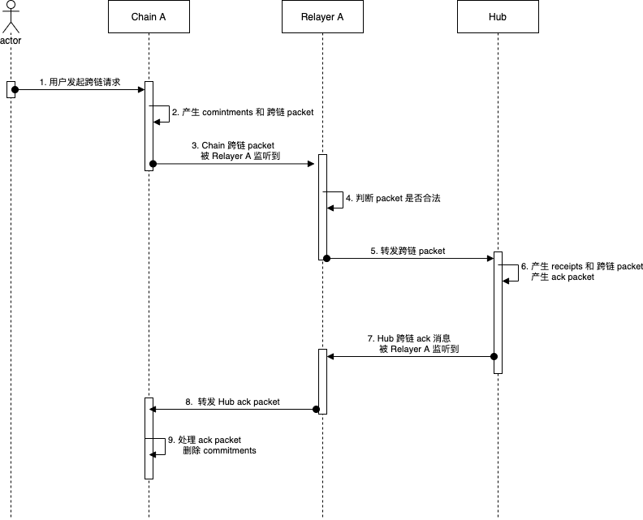

| tics | title                                      | stage  | category                        | kind       | requires  | required-by     | author                               | created  | modified  |
| ---------------- | ---------------------------------------------- | ---------- | ----------------------------------- | -------------- | ------------- | --------------------- | ---------------------------------------- | ------------ | ------------- |
| 18               | Relayer Algorithms | draft  | TIBC/TAO  | interface  | 23            |  | | 2021-07-26   | 2021-07-26   |

## Synopsis 大纲

relayer 算法是 TIBC 的“物理”连接层 -- off-chain(链外) 进程负责通过扫描每个链的状态，构建适当的数据报并在协议允许的异构链（the opposite chain）上执行它们，在运行 TIBC 协议的两个链之间中继数据。

### Motivation 动机

在 TIBC 协议中，区块链只能记录将特定数据发送到另一条链的意图，而不能直接访问网络传输层。 物理数据报中继必须由可访问传输层（例如TCP/IP）的链外基础设施执行。 该标准定义了 relayer 算法的概念，该算法可由具有查询链状态能力的链外进程执行，以执行此中继。


### Definitions 定义

*relayer* 是一个 *off-chain(链外)* 进程，具有使用 TIBC 协议读取交易状态并将交易提交到某些分类账集的能力。

### 所需属性 Desired Properties

- TIBC 的 一次性 或 交付超时 安全属性都不应完全取决于relayer行为（假设拜占庭relayer）
- TIBC 的数据包中继活性属性应仅依赖于至少一个正确的活跃 relayer 的存在。
- 中继应该是未经许可的，所有必要的验证都应在链上执行。
- 应尽量减少 TIBC 用户和 relayer 之间的必要通信。
- 应在应用层提供 relayer 激励措施。

## 技术指标 Technical Specification

### 基本relayer算法 Basic relayer algorithm

relayer 算法是在实现 TIBC 协议的一组 *C* 链上定义的。 每个 relayer 不一定可以访问链间网络中所有链的状态读取数据报或向链间网络中的所有链写入数据报（特别是在许可链或专用链的情况下）-不同的 relayer 可以在不同的子集之间中继。

relayer 每隔一段时间就调用一次 `relay` —- 在任何一条链上，每个块的 relay 调用频率都不超过一次，根据 relayer 希望中继的频率，调用的频率可能更低。

不同的 relayer 可能会在不同的链之间进行中继 -- 只要每对链中至少有一个正确且有效的 relayer ，并且链保持有效，网络中 链之间流动的所有数据包最终都将被中继。

relayer 支持实现多客户端sdk，但每次启动的实例只能配置两个相连的链配置。

#### Relayer 架构


新接入sdk客户端，必须完成以下接口

```go
interface IChain {
    func GetBlockAndPackets(height uint64)  (interface{}, error);
    func GetBlockHeader(height uint64)  (interface{}, error);
    func GetLightClientState(chainName string)  (interface{}, error); 
    func GetLightClientConsensusState(chainName string, height uint64)  (interface{}, error);
    func GetStatus()  (interface{}, error);
    func GetLatestHeight()  (uint64, error);
    func GetDelay()  uint64;
}
```

业务层需要实现以下接口

```go
interface IService {
    func UpdateClient(chain: Chain, counterparty: Chain);
    func PendingDatagrams(chain: Chain, counterparty: Chain): List<Set<Datagram>>;
}
```

relayer 用两个线程管理包中继

线程1主要用来定时更新客户端的可用性

```go
func UpdateClient(chain: Chain, counterparty: Chain) {
    height = chain.GetLatestHeight()
    client = counterparty.GetLightClientConsensusState(chain)
    if client.height < height {
      header = chain.GetBlockHeader(height+1)
      counterpartyDatagrams.push(ClientUpdate{chain, header})
    }
    submitDatagramHeader = ConversionHeaderMsg(blockData)
    submitTx(txs, dest)
}
```

线程2主要用来中继`packet`，处理步骤如下：

1. relayer 从 目标链获取 **源链** 的已 *中继* 的最新高度 `latestHeight` 。
2. relayer 去 **源链** 获取 `latestHeight+1`的 区块头，获取`latestHeight-delay`的 `packet`
3. relayer 组装获取到的`submitDatagramHeader`和`submitDatagramPacket`信息，并提交

```go
func pendingDatagrams(source: Chain, dest: Chain) {
    latestHeight = dest.GetLightClientState(chain_name)
    blockData = source.getBlockHeader(latestHeight+1)
    submitDatagramHeader = ConversionHeaderMsg(blockData)
    blockPacketData, proof = source.GetBlockAndPackets(latestHeight-delay)
    submitDatagramPacket = ConversionPacketMsg(blockPacketData, proof)
    txs = []tx{submitDatagramHeader, submitDatagramPacket}
    submitTx(txs, dest)
}
```

### 数据包 Packets

#### 中继数据包 Relaying packets

可以以基于事件的方式中继无序信道中的数据包。 relayer 应在源链(source chain)中监视每当发送数据包时发出的事件，然后使用事件(event)日志中的数据来组成数据包。 随后， relayer 应通过在数据包的序列号查询是否存在确认来检查目的链是否已接收到该数据包，如果尚未出现， relayer 应中继该数据包。

### 待处理的数据报 Pending datagrams

`pendingDatagrams` 整理从一台机器发送到另一台机器的数据报。 此功能的实现将取决于两台机器都支持的 TIBC 协议的子集以及源机器的状态布局。 特定的 relayer 可能还希望实现其自己的过滤器功能，以便仅中继可能被中继的数据报的子集（例如，已支付报文的子集以某种链下方式中继）。

下面概述了在两条链之间执行单向中继的示例实现。 可以通过切换 `chain` 和 `counterparty` 来更改为执行双向中继。 哪个 relayer 进程负责哪个数据报是一个灵活的选择-在此示例中， relayer 进程中继在 `chain` 上开始的所有握手（将数据报发送到两条链），将所有从 `chain` 发送的数据包中继到 `counterparty` ， 并将从 `counterparty` 发送的所有数据包确认转发到`chain`。

1. 用户发起跨链交易
2. 链 A 产生 commitments → packet
3. Relayer A Listen/Pull 链 A 的跨链请求，判断 Packet 中的 Dest Chain：
    - 若是 Hub 或 Hub 中注册的 Zone，则进行转发
    - 若都不是，则丢弃
4. Hub 收到跨链请求
    - 若 Dest Chain 是自己，则产生：
        - ack
        - receipts → packet
    - 若 Destin Chain 不是自己，则产生：
        - commitments → packet
        - receipts → packet
5. Relayer B Listen/Pull Hub 的跨链请求，并向 Dest Chain 进行转发
6. Chain B 接收到请求并进行处理，产生：
    - receipts → packet
    - ack
7. Relayer B 将 Chain B 的 ack 返回 Hub
8. Hub 存储 ack 并删除 commitments
9. Relayer A 将 Hub 的 ack 返回链 A
10. 链 A 接收到 ack 后删除 commitments

一跳时序图



两跳时序图


```go
func pendingDatagrams(chain: Chain, counterparty: Chain): List<Set<Datagram>> {
    const localDatagrams = []
    const counterpartyDatagrams = []
  
    // ICS2 : Clients
    // - Determine if light client needs to be updated (local & counterparty)
    height = chain.GetLatestHeight()
    client = counterparty.GetLightClientConsensusState(chain)
    if client.height < height {
      header = chain.GetBlockHeader(height+1)
      counterpartyDatagrams.push(ClientUpdate{chain, header})
    }
    // 获取packet 数据报
    chainDelay = chain.GetDelay()
    submitDatagramPacket = ConversionPacketMsg(blockPacketData, proof)
    counterpartyDatagrams.push(Packcet{counterparty, submitDatagramPacket})

    counterpartyHeight = counterparty.latestHeight()
    client = chain.GetLightClientConsensusState(counterparty)
    if client.height < counterpartyHeight {
      header = counterparty.GetBlockHeader(counterpartyHeight+1)
      localDatagrams.push(ClientUpdate{counterparty, header})
    }

    // 获取packet 数据报
    counterpartyDelay = counterparty.GetDelay()
    blockPacketData, proof = counterparty.GetBlockAndPackets(counterpartyHeight-counterpartyDelay)
    submitDatagramPacket = ConversionPacketMsg(blockPacketData, proof)
    localDatagrams.push(Packcet{counterparty, submitDatagramPacket})
    return [localDatagrams, counterpartyDatagrams]
  }
```

relayer 可以选择过滤这些数据报，以中继特定的客户端，特定种类的数据包，也许是根据费用支付模型（本文档未指定，因为它可能会有所不同）。

### 差错处理 Error handling

为了降低存储压力，额外实现 ClearPacket，可由链上定时或链外触发执行

Packet 被 Clear 之后，Relayer 可能作恶将历史的 Packet 重新上传，这样可能会导致重复跨链并成功执行

解决办法：链上存储最后清理的 Sequence，Packet 跨链时，需要判断该 Packet 的 Sequence 必须大于清理的最新 Sequence

```go
// 链上可能如下处理
func validBasic(packet: Packet, counterparty: Chain)  error {
    // 获取链上存储的清理的sequence
    latestSequence = counterparty.GetLatestSequence()
    if packet.sequence < latestSequence{
        return error("curSequence < latestSequence")
    }
} 

```

### 排序约束 Ordering constraints

在 relayer 进程上存在隐式排序约束，以确定必须以什么顺序提交哪些数据报。 例如，必须先提交标头才能最终确定存储在轻客户端中特定高度的共识状态和承诺根，然后才能转发数据包。 relayer 进程负责频繁查询它们在其间中继的链的状态，以确定何时必须中继什么。

### 打包  Bundling

如果主机状态机支持它，则 relayer 进程可以将许多数据报打包到一个交易中，这将导致它们按顺序执行，并摊销所有间接费用（例如，签名检查以支付费用）。

### 竞争条件 Race conditions

在同一对模块和链之间进行中继的多个 relayer 可能会尝试同时中继相同的数据包（或提交相同的标头）。 如果两个 relayer 这样做，则第一个交易将成功，而第二个交易将失败。 为减轻这种情况， relayer 之间或发送原始数据包的参与者与 relayer 之间的带外协调是必要的。 进一步的讨论超出了本标准的范围。

### 激励 Incentivisation

relayer 进程必须能够访问两个链上的帐户，并有足够的余额支付交易费用。 relayer 可以采用应用程序级别的方法来补偿这些费用，例如通过在数据包数据中包括对自己的少量支付 -— relayer 费用支付的协议将在此 ICS 的未来版本中或在单独的 ICS 中进行描述。

